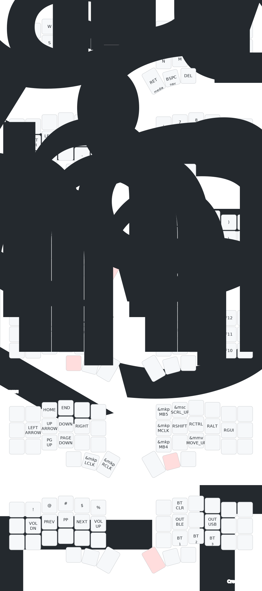

# TBK Mini Corne Layout

 

 config customized for German writing on the  with 42 keys.

## Notes

Works best with the "US (intl) with AltGr dead keys" layout, e.g. setting the following in a sway config:

```
input * {
    xkb_layout us
    xkb_variant intl
}
```

The layout was initially adapted from  and automatic keymap visualizations were created by .

## Keymap



